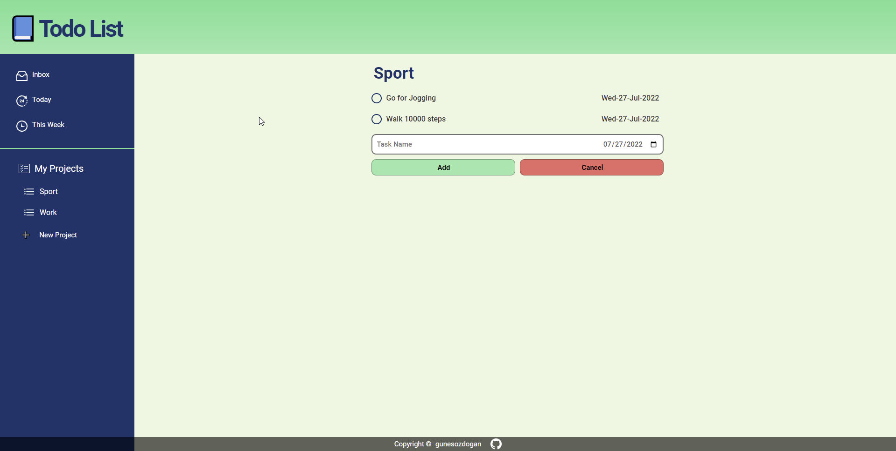
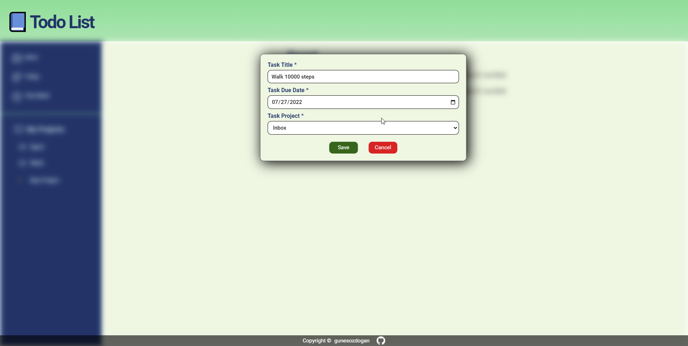

# Todo List

-   Webpack is used to bundle files.
-   Localstorage is used to save data on the browser.

## Functionalities

-   Creating tasks for inbox page or other project pages.
-   Displaying today's tasks and this week's tasks.
-   Editing tasks and moving between projects and inbox.
-   Saving tasks to localstorage.

<a href="https://gunesozdogan.github.io/todo-list/" name="demo">Live Demo</a>

